## Install packages
```js 
npm install
```

## How to run the demo
```js
node app.js
```
Open browser to view [http://localhost/login](http://localhost/login)

## LUIS workflow
LUIS登入首頁。
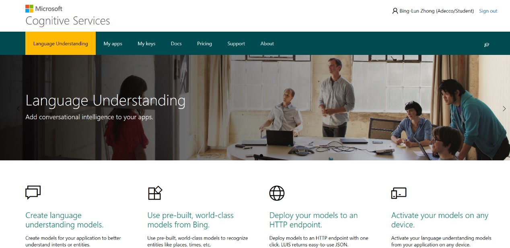
登入後點選My App創建一個App。
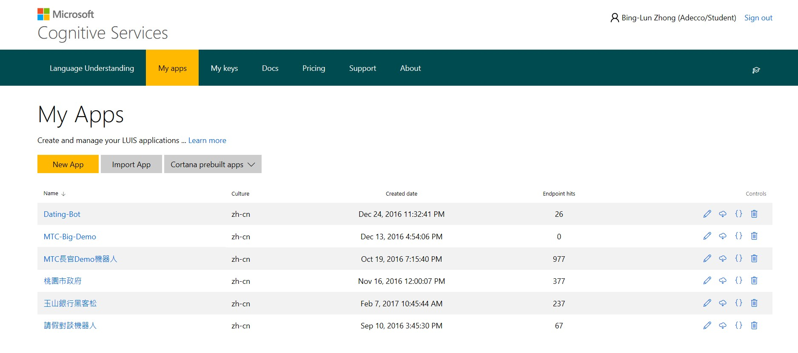
命名以及選擇語言為中文。
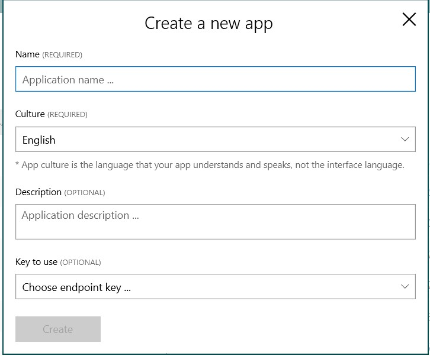
新增Intent
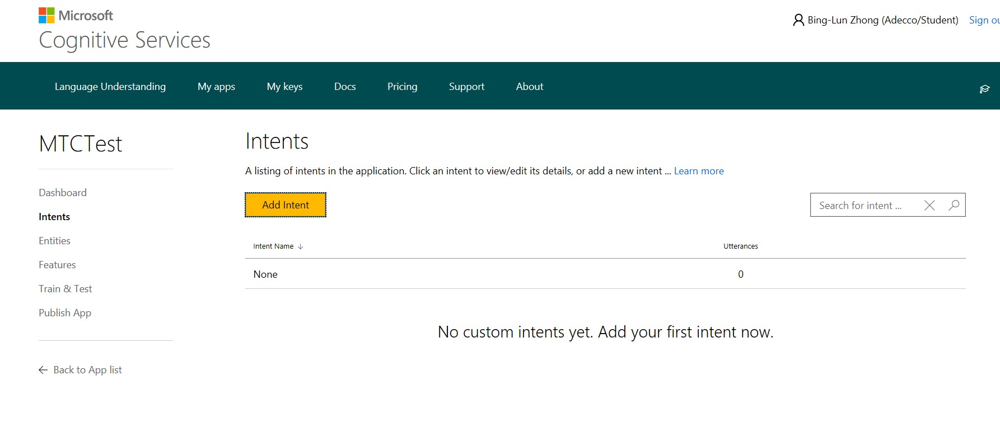
新增Entity
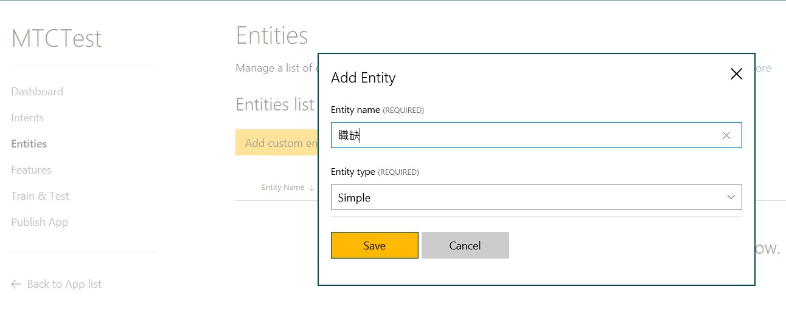
訓練句子
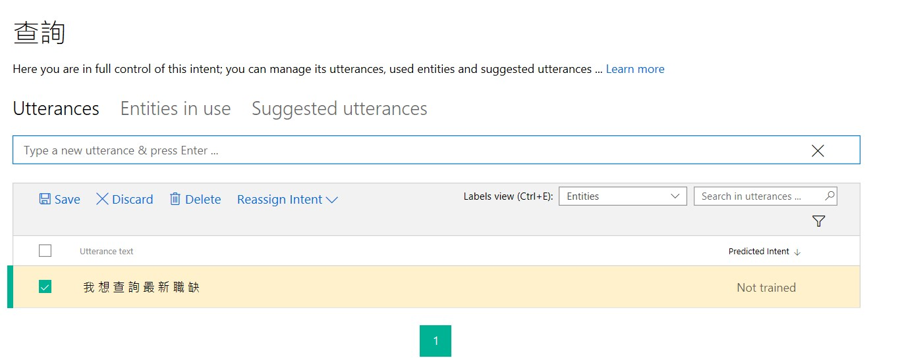
標註Entity
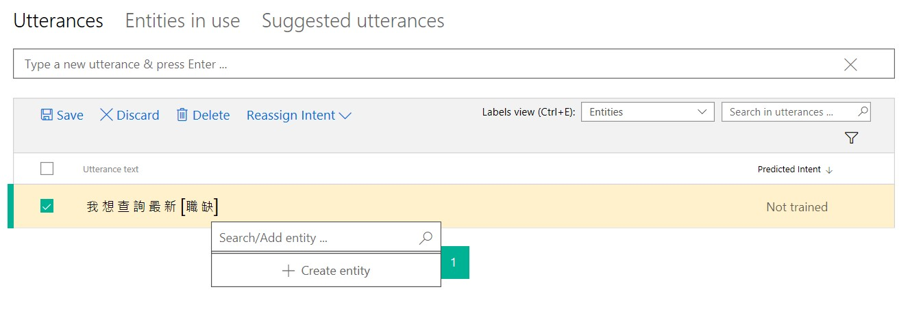
訓練完成
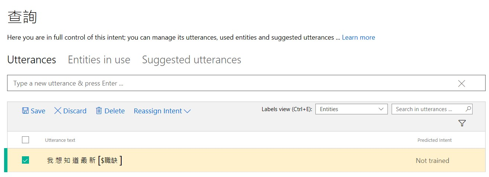
Train Luis App
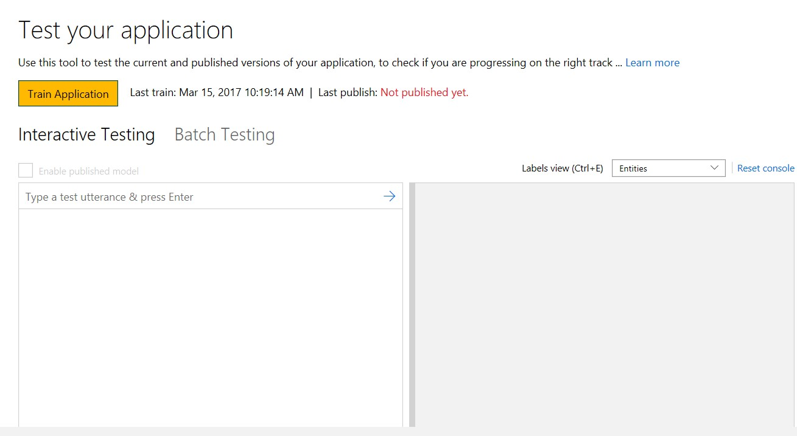
測試 Luis App 成功
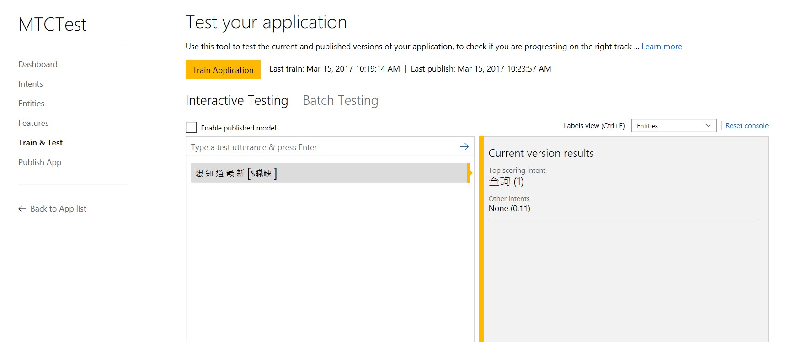
發布Luis App
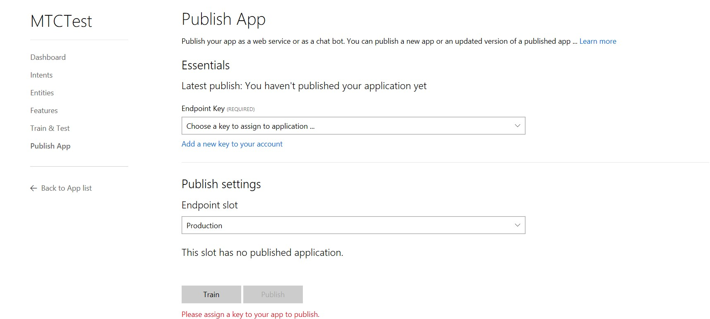
或是匯入JSON Data
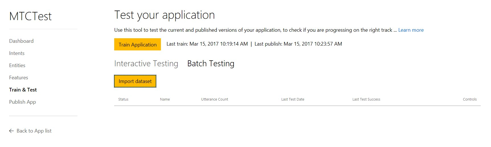
取得Luis App Key
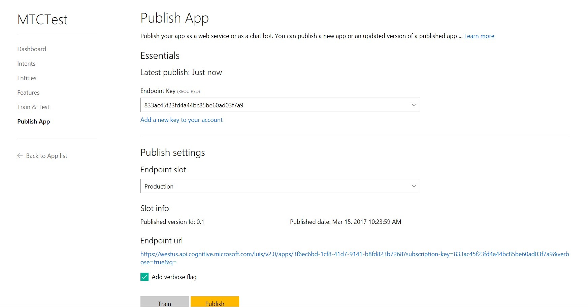


## Reference 
[Microsoft Cognitive Service](https://www.microsoft.com/cognitive-services/en-us/)

[Microsoft Cognitive Service API](https://www.microsoft.com/cognitive-services/en-us/documentation)

[LUIS](https://www.luis.ai/)

[ESun Hackthon API]()

[Node](https://nodejs.org/en/)

[Express](http://expressjs.com/zh-tw/)